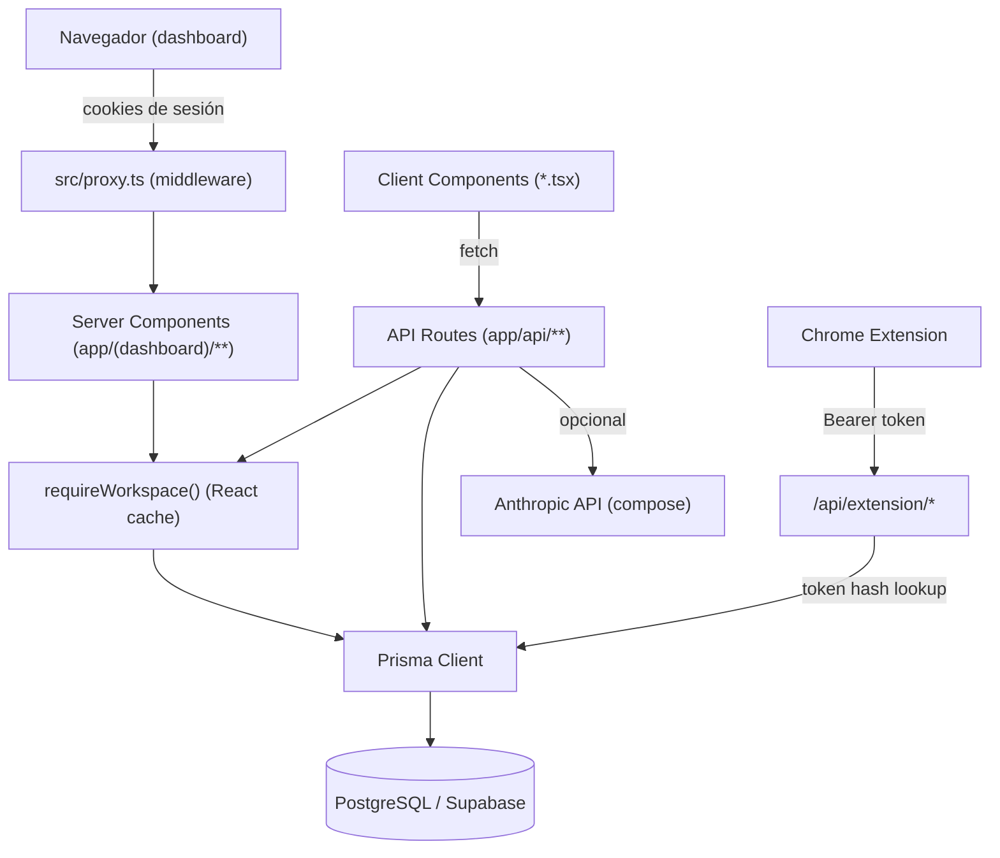
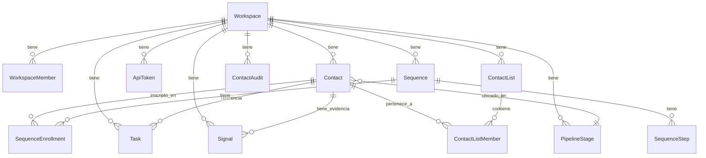

# PROJECT BLUEPRINT — Folkleaf CRM

> **Qué es este documento:** un blueprint reutilizable de desarrollo, escrito para que otra instancia de Claude (sin acceso a la conversación original) pueda entender qué se construyó, cómo, por qué, y qué de todo esto sirve como conocimiento reutilizable para futuros proyectos.
>
> **Qué NO es:** documentación de usuario final, ni un README de instalación (eso ya existe en `README.md`).
>
> Generado por auditoría directa del repositorio (código, `git log`, schema de Prisma) el 2026-09-11. Ningún dato de este documento fue inventado; donde no pudo determinarse algo con certeza, se indica explícitamente como **"No determinable a partir del repositorio."**
>
> **Ningún secreto real está incluido en este documento.** Todas las referencias a variables de entorno usan nombres, nunca valores.

---

## Índice

1. [Resumen ejecutivo](#1-resumen-ejecutivo)
2. [Historia del desarrollo](#2-historia-del-desarrollo)
3. [Arquitectura](#3-arquitectura)
4. [Modelo de datos](#4-modelo-de-datos)
5. [Inventario de APIs](#5-inventario-de-apis)
6. [Chrome Extension](#6-chrome-extension)
7. [Demand Signal Scoring](#7-demand-signal-scoring)
8. [Action Recommendation System](#8-action-recommendation-system)
9. [Decisiones de arquitectura](#9-decisiones-de-arquitectura)
10. [Patrones reutilizables](#10-patrones-reutilizables)
11. [Específico del proyecto vs. Know-how reutilizable](#11-específico-del-proyecto-vs-know-how-reutilizable)
12. [Lessons Learned](#12-lessons-learned)
13. [Estado actual (matriz de funcionalidades)](#13-estado-actual-matriz-de-funcionalidades)
14. [Roadmap](#14-roadmap)
15. [Cómo reutilizar este Blueprint](#15-cómo-reutilizar-este-blueprint)
16. [Master Prompt](#16-master-prompt)
17. [Notas de auditoría](#17-notas-de-auditoría)

---

## 1. Resumen ejecutivo

Folkleaf CRM es una réplica interna de folk.app construida para el equipo de Demand Generation de Witbor. Es una herramienta de uso interno (pocos usuarios, un solo workspace activo en producción), no un SaaS multi-tenant de cara al público, aunque el modelo de datos ya soporta múltiples workspaces de forma nativa.

Cubre:
- Pipeline de leads estilo Kanban (drag & drop).
- Tablas de Clientes / Partners / Contactos interesantes, con importación masiva desde CSV/XLSX.
- Una extensión de Chrome que captura contactos desde perfiles de LinkedIn.
- Gestión de tareas, con sincronización automática desde la fecha de "próximo seguimiento" de un contacto.
- Un compositor de mensajes asistido por IA (Claude, vía Anthropic SDK).
- Un builder de secuencias de outreach (diseño de pasos + inscripción de contactos — **sin envío real todavía**).
- Listas de contactos, para inscribir a varios en una secuencia de una vez.
- **Demand Signal Scoring**: un sistema de puntaje explicable (4 dimensiones + evidencia) para priorizar prospectos.
- **Recomendación de Acción**: un motor de reglas determinístico que responde "¿qué hacer con este prospecto ahora?".
- Papelera (soft-delete) de contactos y un registro de auditoría mínimo sobre cambios de categoría.

Todo el desarrollo ocurrió en una ventana de tiempo muy corta (2026-09-09 a 2026-09-11, según `git log`), con un usuario no técnico dirigiendo el producto y Claude Code implementando cada feature de punta a punta (schema → API → UI → verificación → commit).

---

## 2. Historia del desarrollo

Reconstruida a partir de `git log --stat` (19 commits totales, autor único). El primer commit (`43afa48`) es el scaffold de `create-next-app`; todo lo demás es trabajo del proyecto.

### Problema original

Réplica de folk.app para Demand Generation interno, con: pipeline con drag & drop, extensión de Chrome para capturar contactos de LinkedIn, y paneles de clientes/partners/contactos interesantes. (Este objetivo inicial no está en un commit — se infiere del primer commit funcional y de `README.md`, que ya lo describe así desde el principio).

### MVP inicial

**Commit `13875fc` — "Build Folkleaf CRM: pipeline, contacts, sequences, AI composer"** (54 archivos, ~4600 líneas). En un solo commit se construyó:
- Auth completo (Supabase + `proxy.ts` + `requireWorkspace()`).
- Modelo de datos base: `Workspace`, `WorkspaceMember`, `PipelineStage`, `Contact`, `ApiToken`, `Sequence`/`SequenceStep`/`SequenceEnrollment`.
- Pipeline (`PipelineBoard.tsx`, dnd-kit).
- Tablas de contactos (`ContactsTable.tsx`, `ContactFormModal.tsx`).
- Sequence builder con compositor de IA (`SequenceBuilder.tsx`, `AiComposeModal.tsx`, `lib/ai.ts`).
- Settings (tokens de API + gestión de fases del pipeline).
- Extensión de Chrome completa (no versionada en este mismo repo — carpeta hermana `folk-crm-extension`, fuera del alcance de este `git log`).

Este nivel de "todo en un commit" indica que el MVP se diseñó y construyó como una unidad coherente antes del primer commit real a git, no incrementalmente.

### Evolución posterior (orden cronológico real, por commit)

| Fecha | Commit | Qué se agregó |
|---|---|---|
| 09-09 | `d50fb7a`, `7ab6ce7` | Despliegue a producción (Vercel + Supabase) y arreglo de un bloqueo de deploy por mismatch de email de autor de git |
| 09-09 | `41eec24` | Fecha de "próximo seguimiento" en contactos |
| 09-09 | `b07eaac` | Sección de Tareas (modelo `Task` + CRUD + página) |
| 09-09 | `a777fe9` | Sincronización automática: fecha de seguimiento del contacto → tarea vinculada |
| 09-09 | `513c25c` | Tipo de acción de seguimiento (llamada/email/LinkedIn/WhatsApp) + `FollowUpBadge` compartido |
| 09-09 | `b57fd08` | Optimización de performance (`React.cache()` + región de Vercel) |
| 09-10 | `432cfb0` | Acción "Reunión" + link de alta rápida a Google Calendar |
| 09-10 | `0729723` | **Demand Signal Scoring V1** (manual): 4 dimensiones, modelo `Signal`, panel de UI |
| 09-10 | `beb11c7` | **Recomendación de Acción** (motor de reglas) + traducción a español |
| 09-10 | `cd75eda` | Traducción de textos residuales en inglés |
| 09-10 | `d10fa15` | Papelera (soft-delete) de contactos |
| 09-10 | `3a5e3ff` | Sugerencias de Company/Contact Signal derivadas de las señales cargadas |
| 09-10 | `52d735d` | Importación masiva CSV/XLSX |
| 09-10 | `465af98` | Registro de auditoría de cambios de categoría (ver Lessons Learned) + fix de un bug latente |
| 09-10 | `1fec1bf` | Listas de contactos + inscripción masiva en secuencias |
| 09-10 | `16e63bd` | Fix de seguridad: esquemas de URL restringidos a http(s) |

### Decisiones que cambiaron durante el desarrollo

- **Modelo `Company`**: se evaluó explícitamente agregarlo (durante una auditoría de arquitectura pedida por el usuario, previa a construir Demand Signal Scoring) y se decidió **no** construirlo todavía — `Contact.company` sigue siendo texto libre. La decisión fue documentada como consciente, no un olvido.
- **Enrichment / Apollo / Apify**: se discutió en profundidad una arquitectura de 4 capas (Capture → Enrich → Intelligence → Action) con una abstracción `enrichContact()` desacoplada de proveedores. **Nada de esto se implementó** — quedó en la etapa de diseño conceptual. No hay ningún código de integración con Apollo, Apify, FullEnrich ni Prospeo en el repositorio.
- **Google Calendar**: se consideró una integración nativa vía OAuth (crear eventos sin salir del CRM) y se descartó deliberadamente por complejidad (proyecto de Google Cloud, pantalla de consentimiento, tokens de refresco) a favor de un link de "alta rápida" de Google Calendar (sin OAuth, un clic, abre una pestaña nueva).
- **Borrado de contactos**: empezó siendo un `DELETE` real (irreversible). Se cambió a soft-delete (Papelera) después de que el usuario reportara la desaparición de un contacto — no porque se haya encontrado un bug, sino como red de seguridad preventiva.
- **`xlsx` (SheetJS)**: se iba a instalar la versión de npm, pero tiene 2 CVEs altos sin parchear en el registro público. Se pidió permiso explícito al usuario y se instaló la build parcheada directo desde el CDN oficial de SheetJS en su lugar.

### Qué quedó pendiente (explícito, no inferido)

- Envío real de las Secuencias (falta un dominio de correo verificado).
- Integración nativa de Google Calendar (vía OAuth).
- Modelo `Company` / `ContactEnrichment`.
- Cualquier integración con Apollo, Apify, FullEnrich, Prospeo o similares.
- Detección automática de señales (hoy 100% manual).
- Narrowing de `host_permissions` de la extensión de Chrome (identificado en una revisión de seguridad, pendiente de que el usuario confirme la URL de producción exacta).
- Remoción de la variable `SUPABASE_SERVICE_ROLE_KEY` de `.env.example` (existe pero no se usa en ningún lugar del código).

### Qué se descartó deliberadamente

- **"Signal Method"**: el usuario fue explícito en que el sistema de scoring/recomendación **no** debía llamarse ni replicar una metodología propietaria suya llamada "Signal Method" — de ahí los nombres genéricos "Demand Signal Scoring" y "Recomendación de Acción".
- IA para generar el scoring o la recomendación (V1 es 100% reglas determinísticas, por pedido explícito del usuario).
- Un sistema paralelo de tareas para las "acciones sugeridas" de la Recomendación de Acción — se reutilizó el modelo `Task` y el campo `nextBestAction` ya existentes en vez de crear algo nuevo.

---

## 3. Arquitectura

### Stack

| Capa | Tecnología |
|---|---|
| Framework | Next.js 16.3.4 (App Router, Turbopack) |
| Frontend | React 19.2.8, Tailwind CSS 4 |
| Backend | Next.js API Routes (Route Handlers) — no hay un backend separado |
| Base de datos | PostgreSQL (Supabase) |
| ORM | Prisma 6.19.3 |
| Autenticación | Supabase Auth (`@supabase/ssr`) |
| Hosting | Vercel (región fijada a `gru1`, São Paulo, para co-ubicarse con la DB) |
| Control de versiones | GitHub |
| Extensión de navegador | Chrome Manifest V3, JS vanilla, sin build step |
| IA | Anthropic SDK (`@anthropic-ai/sdk`), modelo `claude-opus-5` |
| Parseo de archivos | `papaparse` (CSV), `xlsx`/SheetJS (Excel) — ambos solo en el navegador |
| Validación | Zod 4 |

### Arquitectura lógica



No existe un backend separado: las API Routes de Next.js **son** el backend. No hay microservicios, no hay colas, no hay workers en segundo plano (explícitamente descartado — ver §9).

### Arquitectura de autenticación

**Dashboard (sesión de usuario):**
1. `src/proxy.ts` corre en cada request. Construye un cliente Supabase SSR desde las cookies, llama a `supabase.auth.getUser()`.
2. Rutas de página: sin sesión + ruta no pública → redirect a `/login`. Con sesión intentando entrar a `/login` → redirect a `/pipeline`.
3. Rutas `/api/*` (excepto `/api/extension/*`): sin sesión → `401` JSON directo (nunca un redirect HTML, porque un `fetch()` no puede seguir un redirect a una página de login y parsearla como 401).
4. `src/lib/workspace.ts` → `requireWorkspace()`, envuelto en `React.cache()` para resolver usuario+workspace una sola vez por request (antes se resolvía por separado en el layout y en cada página).
5. Relación usuario↔workspace: **1:1**, creado perezosamente en el primer login (`getOrCreateWorkspaceForUser`). Hay manejo explícito de una condición de carrera (layout y página creando el workspace en paralelo) capturando el error `P2002` de Prisma y re-consultando.
6. **No hay invitaciones ni multi-seat todavía** — el modelo `WorkspaceMember` ya lo soportaría (`role: String`), pero no hay UI ni lógica para invitar a un segundo usuario al mismo workspace.

**Extensión de Chrome (token Bearer):**
1. El usuario genera un token desde Ajustes (`POST /api/tokens`) — formato `folk_live_<24 bytes aleatorios en base64url>`. Se muestra **una sola vez**; el servidor solo guarda `sha256(token)`.
2. La extensión lo guarda en `chrome.storage.sync` junto a la URL del CRM.
3. Cada request a `/api/extension/*` manda `Authorization: Bearer <token>`; el servidor lo hashea y busca el hash en `ApiToken.tokenHash`.
4. `src/proxy.ts` **excluye explícitamente** `api/extension` de su matcher — esas dos rutas nunca pasan por el middleware de cookies, se autentican 100% por su cuenta.
5. CORS permisivo (`Access-Control-Allow-Origin: *`) solo en esas dos rutas — es seguro en este modelo porque la autenticación es por header explícito (Bearer), no por cookie ambient; un sitio malicioso no puede forzar al navegador de la víctima a adjuntar un token que no conoce.

**Riesgos/limitaciones conocidos** (ver también §17):
- Los tokens de la extensión no tienen expiración ni scopes — un token es válido para todo el workspace hasta que se revoca a mano.
- ~~`host_permissions` de la extensión es más amplio de lo necesario (`https://*/*`)~~ — acotado el 2026-09-11 a LinkedIn + la URL real de producción + localhost (ver §18).
- No hay rate limiting propio en ningún endpoint (se apoya en que el espacio de tokens es de 192 bits, impracticable de fuerza bruta).
- ~~No hay CSP configurado.~~ — agregada el 2026-09-11, solo en producción (ver §18).

### Arquitectura de datos

Ver diagrama completo de entidades en §4.

---

## 4. Modelo de datos

Fuente: `prisma/schema.prisma` (verificado línea por línea, no de memoria).



### Core del sistema

| Modelo | Propósito | Notas relevantes |
|---|---|---|
| `Workspace` | Unidad de aislamiento multi-tenant | Un registro por cuenta/equipo |
| `WorkspaceMember` | Vínculo usuario Supabase ↔ workspace | 1:1 hoy; `role: String` ya soporta multi-seat a futuro sin migración |
| `Contact` | **Modelo monolítico** — persona/prospecto | Un solo modelo cubre Lead/Cliente/Partner/Contacto vía el enum `category`. Ver limitación abajo. |
| `PipelineStage` | Columnas del Kanban | `@@unique([workspaceId, order])` |
| `ApiToken` | Autenticación de la extensión | Solo se guarda el hash SHA-256 |

**Limitación de diseño conocida y documentada en el propio schema:** `Contact` mezcla identidad, datos laborales, campos de proceso CRM y campos que solo aplican si `category = LEAD` (`pipelineStageId`, `stageOrder`, `dealValue`). Una auditoría de arquitectura (previa a Demand Signal Scoring) recomendó separar esto en un modelo `Company` — **decisión consciente de no hacerlo todavía**, para no sobre-diseñar antes de necesitarlo.

### Funcionalidades específicas del proyecto

| Modelo | Propósito |
|---|---|
| `Task` | Tareas, con `isFollowUp` para distinguir la tarea auto-sincronizada de una creada a mano |
| `Sequence` / `SequenceStep` / `SequenceEnrollment` | Diseño de secuencias de outreach — **sin envío real** (comentario explícito en el schema) |
| `Signal` | Evidencia detrás del Demand Signal Score (ver §7) |
| `ContactList` / `ContactListMember` | Agrupación estática de contactos (many-to-many simple, sin membresía dinámica/inteligente) |
| `ContactAudit` | Trail forense mínimo — hoy solo registra cambios de `Contact.category` |

### Estructuras preparadas para futuras funcionalidades

- `Signal.companyId` (`String?`, sin relación): reservado para cuando exista un modelo `Company` — hoy las señales siempre cuelgan de un `Contact`.
- `SignalType` incluye valores sin detección automática todavía: `HIRING`, `TECHNOLOGY`, `GROWTH`, `FUNDING`, `EXPANSION`, `LEADERSHIP`, `NEWS`, `OTHER` — están en el enum para que una futura integración externa pueda escribir señales de esos tipos sin migración.
- `ContactSource.IMPORT`: se agregó al enum antes de tener importación real, y quedó sin usar varios commits hasta que se construyó la feature de import CSV/XLSX.
- `WorkspaceMember.role`: ya es un string libre, listo para roles reales cuando haya multi-seat.

---

## 5. Inventario de APIs

Todas las rutas devuelven JSON. Patrón uniforme: `body = await request.json().catch(() => null)` → `schema.safeParse(body)` → `400` con `error.flatten()` si falla; `401` `{error:"Unauthorized"}` si no hay sesión; `404` `{error:"Not found"}` si el recurso no pertenece al workspace. Toda ruta (salvo las 2 de extensión) llama `requireWorkspace()` y valida ownership antes de leer/escribir.

### Contacts

| Método | Ruta | Propósito | Notas |
|---|---|---|---|
| GET | `/api/contacts` | Listar (por `category`) | Filtra `deletedAt: null` |
| POST | `/api/contacts` | Crear | Dispara `syncFollowUpTask` si trae fecha de seguimiento |
| PATCH | `/api/contacts/[id]` | Editar (parcial) | Escribe en `ContactAudit` si cambia `category`; dispara `syncFollowUpTask` siempre |
| DELETE | `/api/contacts/[id]` | Archivar (default) o borrar definitivo (`?permanent=true`) | Soft-delete por defecto |
| POST | `/api/contacts/[id]/restore` | Restaurar desde Papelera | Limpia `deletedAt` |
| POST | `/api/contacts/import` | Importación masiva | Ver §detalle abajo |
| GET/POST | `/api/contacts/[id]/signals` | Listar/crear señales de un contacto | |
| PATCH/DELETE | `/api/contacts/[id]/signals/[signalId]` | Editar/borrar una señal | |

**Detalle `POST /api/contacts/import`:**
- Auth: sesión.
- Input: `{category, contacts: Array<{fullName, email?, phone?, company?, title?, location?, linkedinUrl?, notes?}>}` (hasta 500 filas).
- Validación: `importContactRowSchema` — solo `fullName` es obligatorio; `linkedinUrl` se sanea con `sanitizeHttpUrl()` (dropea silenciosamente valores no-http(s) en vez de rechazar la fila).
- Efecto en DB: crea contactos con `source: "IMPORT"`; saltea filas sin nombre y filas cuyo email ya existe en el workspace (case-insensitive).
- Respuesta: `{contacts, createdCount, skippedDuplicate, skippedInvalid}`.

### Signals — ver arriba (anidadas bajo Contact)

### Tasks

| Método | Ruta | Propósito |
|---|---|---|
| GET/POST | `/api/tasks` | Listar / crear |
| PATCH/DELETE | `/api/tasks/[id]` | Editar (incluye completar) / borrar |

### Sequences

| Método | Ruta | Propósito |
|---|---|---|
| GET/POST | `/api/sequences` | Listar / crear |
| GET/PATCH/DELETE | `/api/sequences/[id]` | Leer completo (con steps+enrollments) / renombrar / borrar |
| POST/PUT | `/api/sequences/[id]/steps` | Agregar paso / reordenar todos (transacción de 2 pasadas, +1000 para esquivar el `@@unique`) |
| PATCH/DELETE | `/api/sequences/[id]/steps/[stepId]` | Editar / borrar un paso |
| POST | `/api/sequences/[id]/enrollments` | Inscribir un contacto (409 si ya estaba) |
| POST | `/api/sequences/[id]/enrollments/bulk` | Inscribir varios contactos a la vez — saltea los ya inscritos, no falla |
| PATCH/DELETE | `/api/sequences/[id]/enrollments/[enrollmentId]` | Cambiar estado/paso actual / quitar inscripción |

### Lists

| Método | Ruta | Propósito |
|---|---|---|
| GET/POST | `/api/lists` | Listar (con conteo de miembros) / crear |
| GET/PATCH/DELETE | `/api/lists/[id]` | Leer con miembros / renombrar / borrar (cascada solo sobre la membresía, no sobre los contactos) |
| POST | `/api/lists/[id]/members` | Agregar contactos (dedupe silencioso si ya son miembros) |
| DELETE | `/api/lists/[id]/members/[contactId]` | Quitar un contacto de la lista |

### Otros

| Método | Ruta | Propósito |
|---|---|---|
| GET/POST/PUT | `/api/stages` | Listar / crear / reordenar fases del pipeline |
| PATCH/DELETE | `/api/stages/[id]` | Renombrar / borrar (bloqueado si es la última fase) |
| GET/POST | `/api/tokens` | Listar (sin el hash) / generar (devuelve el token crudo una sola vez) |
| DELETE | `/api/tokens/[id]` | Revocar |
| POST | `/api/ai/compose` | Generar mensaje con Claude (email o LinkedIn); 502 si falla la IA |
| POST | `/api/extension/contacts` | **Auth: Bearer token.** Upsert por `linkedinUrl` (excluye soft-deleted del dedupe) |
| GET | `/api/extension/ping` | **Auth: Bearer token.** Test de conexión, devuelve el nombre del workspace |

---

## 6. Chrome Extension

Manifest V3, sin build step (JS vanilla servido tal cual). Vive en `folk-crm-extension/`, hermana de `folk-crm/`, **fuera del historial de git de este repo** (no tiene commits propios en `git log` de `folk-crm`).

### Patrón general (verificado contra la implementación real)

```text
LinkedIn (perfil, DOM autenticado, clases hasheadas)
      ↓  (content script lee innerText, no clases CSS)
content.js  — scrapea + arma un panel con Shadow DOM
      ↓  chrome.runtime.sendMessage
background.js  (service worker) — único lugar con fetch()
      ↓  Authorization: Bearer <token>
/api/extension/contacts  (backend, auth por token)
      ↓  upsert por linkedinUrl
PostgreSQL
```

Esto **sí** refleja fielmente la implementación — no es una simplificación.

### Manifest (`manifest.json`)

- `permissions`: `storage`, `activeTab`.
- `host_permissions` (estado original al 2026-09-11): `["https://www.linkedin.com/*", "http://localhost/*", "https://*/*"]` — el último era más amplio de lo necesario. **Corregido el 2026-09-11** a `["https://www.linkedin.com/*", "https://folk-crm-xi.vercel.app/*", "http://localhost:3000/*"]` — ver §18.
- `content_scripts` matchea todo `linkedin.com` (no solo `/in/*`), porque LinkedIn es una SPA y no recarga la página al navegar entre perfiles.
- `web_accessible_resources`: expone `content.css` (necesario porque el widget vive en Shadow DOM y su `<link>` necesita poder cargarse).

### Content script (`content.js`)

**Por qué no usa selectores CSS/clases:** LinkedIn genera clases hasheadas por build (`e7c0a629`, etc.) que cambian en cada deploy de LinkedIn, y la página autenticada no tiene `<h1>` ni meta tags `og:title`/`og:image` (esos solo existen en el HTML público, no logueado). La solución fue leer `main.innerText`, partido por líneas — el orden visual del "top card" es lo único estable.

**Heurísticas de parseo** (cada una nació de un bug real, ver §12):
- `fullName`: `document.title` (siempre `"Nombre | LinkedIn"`) con fallback a la primera línea del innerText.
- `isDegreeBadge()`: filtra líneas tipo `"• 2º"` (badge de grado de conexión) que a veces aparecen antes del headline real.
- `looksLikeLocation()`: heurística basada en comas, longitud, y exclusión de líneas de "seguidores"/"info de contacto" — buscada **estrictamente después** del headline (el headline mismo puede tener comas y daba falsos positivos).
- `findAvatarUrl()`: primer `` con `alt` no vacío.

**Inyección segura de datos scrapeados:** el panel se arma con `innerHTML` + template literal, pero cada valor pasa por `escapeAttr()` (escapa `"` → `&quot;`) antes de interpolarse dentro de un atributo `value="..."`. Es la forma correcta de neutralizar el vector de inyección para ese contexto específico (romper el atributo con una comilla) — verificado como seguro en la auditoría de seguridad.

**Gating de visibilidad:** el botón flotante solo se muestra si `location.pathname` matchea `/^\/in\//` (perfil real), y un `MutationObserver` sobre `document.body` detecta la navegación SPA (con debounce de 800ms) para mostrar/ocultar el widget sin recargar la extensión.

### Background script (`background.js`)

Único punto de la extensión que hace `fetch()`. Dos funciones: `saveContact(payload)` y `testConnection()`. Ambas leen `{apiUrl, apiToken}` de `chrome.storage.sync` y devuelven `{ok, ...}` al content script vía el callback de `chrome.runtime.onMessage`.

### Popup (`popup.js` / `popup.html`)

UI de configuración: inputs de URL + token, botones "Guardar" y "Probar conexión". Persiste en `chrome.storage.sync` (se sincroniza entre instalaciones de Chrome del mismo usuario).

### Campos capturados hoy

| Campo | ¿Se captura? | Cómo |
|---|---|---|
| `fullName` | Sí | `document.title` + fallback innerText |
| `headline` | Sí | línea siguiente al nombre, saltando degree badges |
| `location` | Sí | heurística de comas, post-headline |
| `linkedinUrl` | Sí | `<link rel="canonical">` o URL actual sin query string |
| `avatarUrl` | Sí | `` |
| `title` (cargo) | Sí, heurístico — desde 2026-09-11 | `splitHeadline()` sobre el headline (ver §18); vacío si el headline no sigue un patrón conocido |
| `company` | Sí, heurístico — desde 2026-09-11 | Idem, mismo split |

> Actualizado el 2026-09-11 — ver §18. Antes de esa fecha, ambos campos estaban hardcodeados a `""` y solo se completaban si el usuario los tipeaba a mano en el panel. Siguen sin completarse automáticamente si el headline no sigue ninguno de los patrones conocidos (ej. roles múltiples separados por comas).

### Deduplicación

Por `linkedinUrl` (único índice funcional dentro del workspace, vía `findFirst` — no hay `@@unique` en el schema, la deduplicación es aplicativa, no a nivel de base). Un contacto archivado (Papelera) queda **excluido** de ese match — volver a capturar el mismo perfil crea uno nuevo en vez de resucitar el archivado.

### Limitaciones actuales

- Captura de `title`/`company` es heurística, no siempre acierta (headlines sin un separador conocido quedan vacíos — ver §18).
- Sin expiración/scopes en el token.
- Es de un solo proveedor (LinkedIn) — el patrón es reutilizable para otras fuentes, pero no hay abstracción de "proveedor de captura" en el código (sería sobre-ingeniería para un solo caso de uso hoy).

> `host_permissions` acotado a los dominios reales (LinkedIn + CRM + localhost) desde 2026-09-11 — ver §18. Ya no aparece acá como limitación.

---

## 7. Demand Signal Scoring

### Principio conceptual (explícito, pedido por el usuario)

> El score debe ser explicable y estar respaldado por señales/evidencia — nunca un número sin justificación.

### IMPLEMENTADO

**4 dimensiones**, cada una 0-5, guardadas directamente en `Contact` (`fitScore`, `companySignalScore`, `contactSignalScore`, `timingScore`), default `0`:

| Dimensión | Escala (0→5) |
|---|---|
| Fit (Encaje) | No encaja/info. insuficiente → Muy bajo → Bajo → Moderado → Alto → Excelente fit |
| Company Signal | Sin señal relevante → Débil → Moderada → Fuerte → Muy fuerte/varias señales → Crítica |
| Contact Signal | Sin señal → Actividad débil → Actividad relevante → Cambio profesional relevante → Señal muy fuerte → Ligada a necesidad comercial |
| Timing (Momento) | Sin indicio actual → Señal antigua → Relativamente reciente → Reciente → Muy reciente → Actual o inminente |

**Score total** = suma de las 4 (máx 20). **Nunca se persiste** — se recalcula siempre en `computeDemandSignalScore()` (`src/lib/scoring.ts`), justamente para que no pueda desincronizarse de las dimensiones.

**Bandas de prioridad** (`classifyDemandScore`):

| Rango | Prioridad |
|---|---|
| 0–5 | BAJA |
| 6–10 | MEDIA |
| 11–15 | ALTA |
| 16–20 | MUY ALTA |

**Evidencia** — modelo `Signal`: `type` (10 valores posibles, ver §4), `description`, `source` (texto libre), `confidence` (LOW/MEDIUM/HIGH), `detectedAt`. CRUD completo desde el panel del contacto.

**Timing — sugerencia basada en recencia:** `suggestTimingScore()` mapea "días desde la señal más reciente" a un score sugerido, vía una tabla de ventanas configurable (`TIMING_WINDOWS`: ≤7d→5, ≤30d→4, ≤60d→3, ≤90d→2, ≤180d→1, más→0). Se muestra como un hint "Sugerido: X · usar" — **nunca sobreescribe**, el usuario aplica con un clic.

**Company/Contact Signal — sugerencia basada en la evidencia cargada:** cada señal suma "puntos" según su `confidence` (alta=2, media=1, baja=0.5) si su `type` corresponde a esa dimensión (`COMPANY_SIGNAL_TYPES` / `CONTACT_SIGNAL_TYPES` en `scoring.ts`). Los puntos totales se mapean a un score sugerido vía `SIGNAL_STRENGTH_WINDOWS`. Mismo patrón de hint-y-un-clic que Timing.

**Fit**: 100% manual, sin sugerencia automática — decisión explícita del usuario ("relativamente estable, no debe depender de señales temporales").

### IDEA / FUTURO (no implementado)

- Detección automática de señales: **piloto agregado el 2026-09-11** para `SignalType.HIRING` (Greenhouse/Lever, disparado a mano — ver §18). El resto de los tipos de señal (`TECHNOLOGY`, `GROWTH`, `FUNDING`, etc.) siguen siendo 100% carga manual.
- IA para interpretar señales o generar el "Why Now".
- Modelo `Company` para señales a nivel organización (`Signal.companyId` existe en el schema pero no tiene relación ni se usa).
- Cualquier proveedor externo (Apollo/Apify/etc.) escribiendo señales automáticamente.

---

## 8. Action Recommendation System

Nombre en código: **Recomendación de Acción**. Toda la lógica vive en una única función pura, `getRecommendedAction()` (`src/lib/recommendation.ts`), que no sabe nada de UI ni de cómo se originaron los puntajes.

### 4 niveles posibles

| Nivel | Label | Descripción fija |
|---|---|---|
| `ACT_NOW` | Actuar ahora | "Este prospecto presenta señales suficientes para justificar una acción comercial prioritaria." |
| `PREPARE_CONTACT` | Preparar contacto | "El prospecto presenta señales relevantes. Revisá el contexto y prepará un contacto personalizado." |
| `MONITOR` | Monitorear | "El prospecto tiene potencial, pero todavía no hay suficiente evidencia para priorizar un contacto inmediato." |
| `DO_NOT_PRIORITIZE` | No priorizar | "Actualmente no hay suficiente evidencia para dedicar esfuerzo comercial a este prospecto." |

### Tabla de decisión (reglas reales, evaluadas en este orden — la primera que matchea gana)

| # | Condición | Resultado | Razón (texto mostrado) |
|---|---|---|---|
| 1 | `fitScore ≤ 2` | `DO_NOT_PRIORITIZE` | "El prospecto presenta un bajo nivel de encaje con el perfil objetivo." — **tiene prioridad sobre todas las demás reglas** |
| 2 | `contactSignalScore ≥ 3` Y `timingScore ≥ 4` Y `fitScore ≥ 3` | `ACT_NOW` | "Existe una señal relevante sobre el contacto y es suficientemente reciente..." |
| 3 | `total ≥ 16` Y `timingScore ≥ 3` | `ACT_NOW` | Texto **dinámico** — armado por `describeContributingFactors()` a partir de qué dimensiones más aportan |
| 4 | `total ≥ 11` Y `timingScore ≥ 3` | `PREPARE_CONTACT` | "...buen nivel de prioridad y señales recientes, pero conviene revisar el contexto..." |
| 5 | `companySignalScore ≥ 4` Y `timingScore ≤ 2` | `MONITOR` | "...señales relevantes en la empresa, pero todavía no son suficientemente recientes..." |
| 6 | `6 ≤ total ≤ 10` | `MONITOR` | "...cierto potencial, pero todavía no hay suficiente evidencia..." |
| 7 | `total ≤ 5` | `DO_NOT_PRIORITIZE` | "Actualmente hay pocas señales y/o bajo encaje..." |
| — | *(caso no cubierto explícitamente por el usuario: total 11-20 sin timing/company-signal suficiente para reglas 4/5)* | `MONITOR` (fallback) | "...puntaje alto, pero no hay señales lo suficientemente recientes..." — **decisión de diseño de Claude, no del usuario**, documentada en el código |

### Acciones sugeridas por nivel

| Nivel | Acciones | Cómo se ejecutan |
|---|---|---|
| `ACT_NOW` | Contactar, Crear tarea, Preparar mensaje | Contactar → escribe `nextBestAction=CONTACT` (campo ya existente); Crear tarea → `POST /api/tasks`; Preparar mensaje → abre el `AiComposeModal` ya existente |
| `PREPARE_CONTACT` | Investigar, Crear tarea, Preparar mensaje | Igual patrón, `nextBestAction=INVESTIGATE` |
| `MONITOR` | Agregar seguimiento, Revisar señales más adelante | La primera escribe `nextBestAction=SCHEDULE_FOLLOWUP`; la segunda es solo informativa (sin acción real detrás) |
| `DO_NOT_PRIORITIZE` | Mantener en CRM, No realizar acción por ahora | La primera es informativa; la segunda escribe `nextBestAction=DO_NOT_CONTACT` |

**Principio de diseño clave:** ninguna acción sugerida creó un sistema paralelo — todas reutilizan `nextBestAction` (ya existía desde Demand Signal Scoring V1), `/api/tasks` (ya existía desde la sección Tareas), o `AiComposeModal` (ya existía desde el MVP).

### Qué está automatizado vs. manual

- **Automatizado:** el cálculo de nivel + razón + acciones sugeridas (recalculado en cada render a partir de los 4 scores).
- **Manual:** cargar los 4 scores, cargar las señales, decidir si aplicar una acción sugerida (nunca se auto-aplica).

---

## 9. Decisiones de arquitectura

### Next.js full-stack (API Routes en vez de backend separado)

**Motivo:** proyecto de un solo desarrollador (Claude) + un usuario no técnico, sin necesidad de escalar independientemente frontend/backend. **Alternativas:** un backend Express/Fastify separado, o Server Actions en vez de Route Handlers. **Trade-off:** gana simplicidad de despliegue (un solo proyecto en Vercel); pierde separación de capas si el proyecto creciera mucho. **Aplicabilidad futura:** reutilizar para cualquier producto interno/MVP de pocos usuarios; reconsiderar si se necesita un backend consumido por múltiples frontends.

### Prisma + Postgres (Supabase) en vez de Supabase client-side directo

**Motivo:** tipado fuerte end-to-end, migraciones versionadas, y no depender de Row Level Security de Supabase para el aislamiento multi-tenant (se hace a mano vía `workspaceId` en cada query). **Alternativas:** usar el cliente JS de Supabase directo con RLS. **Trade-off:** más código de "ownership check" repetido en cada endpoint; a cambio, la lógica de autorización es explícita y auditable en el código de la app, no oculta en policies de SQL. **Aplicabilidad futura:** preferir este patrón cuando el equipo quiere revisar la lógica de permisos en TypeScript, no en SQL.

### Token Bearer propio para la extensión, en vez de compartir la sesión de cookie

**Motivo:** una extensión de navegador no puede leer cookies `httpOnly` de otro origen, y no se quiere que el usuario tenga que loguearse dos veces. **Alternativas:** OAuth de la extensión contra Supabase directamente. **Trade-off:** un sistema de auth adicional (aunque simple) a mantener; a cambio, cero fricción de login para el usuario y CORS trivialmente seguro (`*` es aceptable porque el token no es ambient). **Aplicabilidad futura:** patrón estándar para cualquier integración externa (extensión, CLI, webhook) que necesite hablarle a tu API sin sesión de navegador.

### Score total derivado, nunca persistido

**Motivo:** evitar que el total quede desincronizado de sus 4 partes si se edita una dimensión y se olvida recalcular. **Alternativas:** guardar el total y recalcularlo en cada `update()`. **Trade-off:** una consulta extra de cómputo (trivial) a cambio de garantía de consistencia total. **Aplicabilidad futura:** aplicar siempre que un valor sea 100% derivable de otros campos ya persistidos — nunca guardar lo derivable.

### Sugerencia con un clic, nunca sobreescritura automática

**Motivo:** el usuario pidió explícitamente que el sistema no "decida por él" — los scores deben quedar bajo su control manual, incluso cuando hay evidencia que sugiere un valor distinto. **Alternativas:** recalcular y sobreescribir el score automáticamente cuando cambian las señales. **Trade-off:** requiere que el usuario haga un clic extra; a cambio, nunca hay una sorpresa de "¿por qué cambió esto solo?". **Aplicabilidad futura:** patrón general para cualquier feature de "IA/heurística sugiere, humano decide" — ver también §10.

### Reglas determinísticas en vez de IA, para la Recomendación de Acción

**Motivo:** pedido explícito del usuario — quería un sistema "transparente y fácil de modificar" antes de sumar IA. **Alternativas:** usar un LLM para generar la recomendación directamente. **Trade-off:** las reglas no capturan matices que una IA podría, pero son explicables al 100%, gratis de correr, y se pueden ajustar editando una función pura. **Aplicabilidad futura:** preferir reglas determinísticas como V1 de cualquier sistema de scoring/recomendación; dejar la puerta abierta (inputs/outputs bien tipados) para reemplazar o complementar con IA después sin tocar el resto del sistema.

### Soft-delete (Papelera) en vez de borrado directo

**Motivo:** después de que un usuario reportara la desaparición de un contacto (que resultó ser un dato de prueba, no un bug), se decidió agregar una red de seguridad preventiva. **Alternativas:** mantener el borrado directo y confiar en backups de Supabase. **Trade-off:** una columna `deletedAt` + filtrar `deletedAt: null` en cada query existente (se tocaron 7 lugares); a cambio, ningún borrado accidental es permanente salvo que se confirme dos veces. **Aplicabilidad futura:** aplicar a cualquier entidad donde el borrado accidental sea costoso y el volumen de filas no justifique un sistema de versionado completo.

### Parseo de CSV/XLSX 100% en el navegador

**Motivo:** evitar mandar el archivo crudo al servidor — solo viaja el JSON ya mapeado a campos del CRM. **Alternativas:** subir el archivo y parsearlo server-side. **Trade-off:** el bundle del navegador crece (mitigado con `import()` dinámico, así las librerías no se cargan hasta que se abre el modal de importación); a cambio, menos superficie de ataque en el servidor y no hay que manejar almacenamiento de archivos temporales. **Aplicabilidad futura:** preferir este patrón para cualquier importación de archivos donde el parseo pueda hacerse client-side.

### `ContactAudit` como mitigación en vez de un fix, ante un bug no reproducible

**Motivo:** un contacto cambió de categoría sin que ninguna ruta de código lo explicara, ni siquiera tras auditar cada punto de escritura. En vez de "arreglar" algo que no se pudo diagnosticar, se agregó observabilidad mínima para la próxima vez que pase. **Alternativas:** no hacer nada hasta tener más evidencia. **Trade-off:** una tabla más, sin certeza de que resuelva el misterio. **Aplicabilidad futura:** cuando un bug reportado por el usuario no es reproducible ni explicable por el código, es válido priorizar observabilidad sobre un fix especulativo.

---

## 10. Patrones reutilizables

### Pattern: External Data Capture

**Problema que resuelve:** llevar datos de un sitio de terceros (que no tiene API pública, o cuya API no sirve para este caso) a tu propia base de datos, con la menor fricción posible para el usuario.

**Arquitectura:**
```text
Website externo (LinkedIn)
      ↓  content script lee el DOM renderizado
Browser Extension (content script)
      ↓  chrome.runtime.sendMessage
Background / Service Worker  (único lugar con fetch + token)
      ↓  Authorization: Bearer <token>
Application Backend (API Route con auth propia, fuera del middleware de cookies)
      ↓
Database (upsert con dedupe por una clave natural — acá, linkedinUrl)
```

**Implementación actual:** exactamente como arriba — ver §6.

**Cuándo usarlo:** cuando el usuario necesita capturar datos de un sitio de terceros de forma recurrente y manual (no scraping masivo/automatizado), y ese sitio no tiene una API amigable.

**Cuándo NO usarlo:** para scraping masivo/programado (ahí conviene un proveedor de scraping como servicio, no una extensión de navegador operada a mano); si el sitio SÍ tiene una API oficial mejor usarla directamente.

**Ventajas:** cero infraestructura de scraping (Chrome hace el trabajo pesado, ya logueado como el usuario); dedupe centralizado en el backend, no en el cliente.

**Limitaciones:** frágil ante cambios de DOM del sitio externo (mitigado leyendo texto renderizado en vez de selectores CSS — ver heurísticas en §6); requiere que el usuario tenga la extensión instalada y esté logueado en el sitio externo.

---

### Pattern: Explainable Scoring

**Problema que resuelve:** un score numérico sin justificación no genera confianza ni permite ajustar el criterio.

**Arquitectura:**
```text
Signals (evidencia individual, con tipo/fuente/confianza/fecha)
      ↓
Dimensions (0-5 cada una, agregando evidencia relevante por categoría)
      ↓
Score total (siempre derivado, nunca guardado)
      ↓
Priority (clasificación en bandas)
      ↓
Action (recomendación, ver siguiente patrón)
```

**Implementación actual:** Demand Signal Scoring completo (§7).

**Cuándo usarlo:** cualquier sistema de priorización/scoring donde el usuario necesite poder responder "¿por qué este número?" — ventas, soporte, riesgo, etc.

**Cuándo NO usarlo:** cuando un score puramente estadístico/ML (sin necesidad de explicabilidad humana) es suficiente y más preciso.

**Ventajas:** auditable, ajustable a mano, no requiere IA ni datos de entrenamiento.

**Limitaciones:** el diseño de las dimensiones y sus pesos es manual — no aprende ni se ajusta solo.

---

### Pattern: Deterministic Recommendation Engine

**Problema que resuelve:** convertir un score en una acción concreta, de forma transparente y fácil de ajustar, antes de (o en vez de) usar IA.

**Arquitectura:**
```text
Inputs (dimensiones tipadas)
      ↓
Rules (evaluadas en orden, primera que matchea gana — función pura, sin I/O)
      ↓
Recommendation (nivel + razón + descripción)
      ↓
Next Action (acciones sugeridas, mapeadas a funcionalidad YA EXISTENTE, no nueva)
```

**Implementación actual:** `getRecommendedAction()` (§8).

**Cuándo usarlo:** como V1 de cualquier sistema de recomendación, especialmente si el usuario quiere poder auditar/ajustar las reglas sin depender de un LLM.

**Cuándo NO usarlo:** cuando las reglas serían tan numerosas o interdependientes que se vuelven inmantenibles — ahí un modelo aprendido empieza a tener sentido.

**Ventajas:** costo cero de inferencia, 100% determinístico y testeable, reemplazable por IA después sin tocar el resto del sistema (la función es la única pieza que cambiaría).

**Limitaciones:** requiere que alguien piense explícitamente las reglas y su orden de prioridad; no generaliza a casos no previstos (ver el caso "no cubierto" documentado en §8).

---

### Pattern: Suggestion, Never Silent Override

**Problema que resuelve:** cuando el sistema puede *calcular* un valor mejor que el que el usuario cargó a mano, pero sobreescribirlo automáticamente rompe la confianza del usuario en la herramienta.

**Arquitectura:** el campo sigue siendo 100% manual/editable. Junto a él se muestra un hint calculado ("Sugerido: X según Y · usar") con un botón que, si se toca, aplica el valor exactamente como si el usuario lo hubiera tipeado — mismo endpoint, mismo camino de guardado.

**Implementación actual:** las 3 sugerencias de Demand Signal Scoring (Timing por recencia, Company/Contact Signal por evidencia cargada — §7).

**Cuándo usarlo:** cualquier campo donde exista tanto entrada manual como una fuente de datos/heurística que podría informarlo, y donde sobreescribir sin avisar generaría desconfianza (fechas, scores, prioridades, clasificaciones).

**Cuándo NO usarlo:** campos donde el usuario espera que el sistema simplemente calcule por él sin intervención (ahí conviene calcular y mostrar, sin pedir un clic extra).

---

### Pattern: Reuse Existing Flows Instead of Building Parallel Ones

**Problema que resuelve:** la tentación de crear un sistema nuevo (tareas, mensajes, estados) cada vez que una feature nueva "necesita" registrar una acción.

**Implementación actual:** las acciones sugeridas de la Recomendación de Acción escriben en `nextBestAction` (ya existente) o llaman a `/api/tasks` (ya existente) o abren `AiComposeModal` (ya existente) — cero modelos o endpoints nuevos para "ejecutar" una recomendación.

**Cuándo usarlo:** siempre que una feature nueva produzca una salida que se parece a algo que el producto ya sabe hacer (crear una tarea, mandar un mensaje, marcar un estado).

**Cuándo NO usarlo:** cuando el flujo existente realmente no encaja semánticamente — forzarlo generaría una abstracción incorrecta.

---

### Pattern: MVP-First, Then Incremental, Always Verified

**Problema que resuelve:** evitar sobre-diseñar antes de tener el producto núcleo funcionando, y evitar que cada feature nueva rompa lo anterior.

**Evidencia en este proyecto:** el MVP completo se construyó en un commit (`13875fc`); cada feature posterior es su propio commit, con este ciclo repetido en los 15 commits siguientes:
1. Auditar el código relevante antes de tocar nada.
2. Proponer el cambio mínimo de schema (migración aditiva, nunca destructiva).
3. Implementar backend → UI.
4. Verificar con `tsc --noEmit`, `next build`, y — cuando no había forma de loguearse en un entorno de prueba — scripts de Prisma desechables contra la base real (crear → ejercer la lógica → afirmar el resultado esperado → borrar los datos de prueba) o una ruta `/dev-preview` temporal con props mockeadas, siempre eliminada antes de terminar.
5. Commit con mensaje explicando el *por qué*, no solo el *qué*.

**Cuándo usarlo:** prácticamente siempre que se construye con asistencia de un agente — cada paso verificado reduce drásticamente el riesgo de deuda invisible.

---

### Pattern (diseñado, NO implementado): Provider Abstraction para Enrichment

Durante la auditoría de arquitectura previa a Demand Signal Scoring se diseñó (pero **no se escribió ni una línea de código**) una abstracción conceptual:

```text
Application
      ↓
enrichContact(input) — interfaz única
      ↓
Provider A (Apollo) / Provider B (Prospeo) / Provider C (FullEnrich) / ...
```

La idea era que el CRM nunca dependiera de un proveedor específico. Se investigaron proveedores reales (Apollo, FullEnrich, Prospeo, Apify) y sus trade-offs de cobertura en LATAM, pero la implementación quedó completamente pendiente. **Se documenta acá porque es exactamente el tipo de patrón que vale la pena reutilizar en otro proyecto — pero hay que aclarar que en ESTE repositorio no existe código real de esto.**

---

## 11. Específico del proyecto vs. Know-how reutilizable

### Specific to this project

- El dominio (CRM de Demand Generation, folk.app como referencia visual/funcional).
- El modelo `Contact` monolítico con categorías Lead/Cliente/Partner/Contacto.
- Las 4 dimensiones exactas de Demand Signal Scoring y sus escalas de texto.
- Las 7 reglas exactas de la Recomendación de Acción (los umbrales — 16, 11, 6, etc. — son de este dominio, no universales).
- El scraping de LinkedIn específicamente (heurísticas de `content.js`).
- La decisión de idioma español en toda la UI.
- Los nombres "Demand Signal Scoring" / "Recomendación de Acción" (elegidos deliberadamente para NO coincidir con una metodología propietaria del usuario llamada "Signal Method").

### Reusable Engineering Knowledge

- Los 8 patrones de §10 (incluido el de Provider Abstraction, aunque no implementado acá).
- La arquitectura de autenticación dual (sesión de cookie para dashboard + Bearer token para integraciones externas).
- El principio de "score derivado, nunca persistido".
- El principio de "sugerencia con un clic, nunca sobreescritura silenciosa".
- La metodología de verificación sin credenciales de producción (scripts de Prisma desechables + rutas `/dev-preview` temporales).
- El ciclo de "auditar → migración aditiva → implementar → verificar → commit descriptivo" para cada feature.
- La decisión de instalar una dependencia parcheada desde el canal oficial del mantenedor cuando el registro de npm está desactualizado en seguridad (con permiso explícito del usuario).

**Objetivo declarado por el usuario:** convertir esta segunda sección en una Skill de Claude Code — ver recomendaciones en §17.

---

## 12. Lessons Learned

```text
Problem: Prisma 8.0.0-rc se instaló por default en vez de la v6 estable.
Cause: no se fijó la versión mayor al instalar.
Solution: pin explícito a prisma@6 / @prisma/client@6.
Lesson: fijar versiones mayores de herramientas de infraestructura (ORM, DB drivers) desde el primer install.
Reusable principle: no confiar en "latest" para dependencias que tocan la capa de datos.
```

```text
Problem: variable `location` shadow-eaba a `window.location` dentro de una función del content script (TDZ bug), usada antes de la declaración.
Cause: nombre de variable local coincidente con un global del navegador.
Solution: renombrar a `profileLocation` (ocurrió dos veces, se repitió el mismo error).
Lesson: evitar nombres de variable que coincidan con globals del entorno de ejecución (window.location, window.name, etc.), especialmente en content scripts que corren en la página de un tercero.
Reusable principle: dar nombres específicos del dominio a variables locales, nunca genéricos que puedan chocar con el entorno.
```

```text
Problem: el botón flotante de la extensión no aparecía en LinkedIn.
Cause: el CSS del widget (cargado en Shadow DOM) no estaba en `web_accessible_resources` del manifest.
Solution: agregarlo explícitamente.
Lesson: cualquier asset que un content script cargue dinámicamente (vía <link> o similar) necesita estar declarado ahí, aunque "obviamente" pertenezca a la extensión.
Reusable principle: en Manifest V3, todo recurso cargado desde un content script en runtime debe declararse en web_accessible_resources.
```

```text
Problem: el scraping de LinkedIn no traía ningún dato.
Cause: se asumió (por experiencia con otros sitios) que existirían <h1>/meta og:title — LinkedIn no los tiene en el DOM autenticado, y las clases CSS son hasheadas por build.
Solution: leer innerText del contenedor principal, parsear por orden de línea.
Lesson: no asumir la estructura de un sitio de terceros sin inspeccionarlo primero — las heurísticas "estándar" de scraping no siempre aplican a SPAs autenticadas.
Reusable principle: cuando selectores estructurales no son estables, el orden visual del texto renderizado suele serlo más.
```

```text
Problem: condición de carrera creando el Workspace de un usuario nuevo (layout y página lo hacían en paralelo en el primer login).
Cause: dos Server Components independientes llamando a la misma función de "crear si no existe" sin coordinación.
Solution: capturar el error P2002 (constraint único) de Prisma y volver a consultar en ese catch.
Lesson: en Next.js App Router, layout y page pueden ejecutar lógica async en paralelo — cualquier "get or create" necesita ser resiliente a ejecutarse dos veces a la vez.
Reusable principle: todo "find or create" en un entorno concurrente necesita manejar el caso de constraint violation como un camino válido, no un error.
```

```text
Problem: variables de entorno de Supabase (URL/keys) llegaban vacías o corruptas en producción.
Cause: se habían cargado como tipo "Secret" en Vercel (write-only) y el valor se corrompió/vació en el proceso; también un caracter no-ASCII se coló en un copy-paste.
Solution: recrearlas como tipo "Config" (revelable) con copy-paste cuidadoso directo desde el dashboard de Supabase.
Lesson: el tipo "Secret" de Vercel dificulta detectar corrupción porque no se puede releer el valor.
Reusable principle: para variables públicas (NEXT_PUBLIC_*), usar tipo "Config" en Vercel — permite verificar el valor después de guardarlo.
```

```text
Problem: fechas de seguimiento se mostraban un día antes para el usuario (en Argentina, UTC-3).
Cause: se guardaba una fecha "pelada" (medianoche UTC) y se formateaba/comparaba en la zona horaria local del navegador.
Solution: formatear y comparar siempre explícitamente en UTC.
Lesson: cualquier fecha sin hora significativa (solo día/mes/año) debe tratarse como UTC de punta a punta, nunca convertirse a zona local.
Reusable principle: separar conceptualmente "fecha calendario" (sin timezone) de "instante en el tiempo" (con timezone) desde el diseño del schema.
```

```text
Problem: lentitud percibida en producción.
Cause: el layout y cada página resolvían sesión+workspace de forma independiente (2+ round-trips redundantes a Supabase Auth y a la DB por request); además la función serverless de Vercel no estaba co-ubicada con la región de la base de datos.
Solution: `React.cache()` alrededor de `requireWorkspace()`, y fijar la región de Vercel a la misma región que Supabase (`gru1`).
Lesson: en App Router, cualquier función async llamada desde layout Y page en la misma request se ejecuta dos veces salvo que se memorice explícitamente.
Reusable principle: envolver siempre en `cache()` cualquier resolución de auth/contexto que se necesite en más de un Server Component de la misma request; verificar que la región de compute coincida con la región de la base de datos.
```

```text
Problem: un contacto cambió de categoría (Contacto → Lead) sin explicación encontrada en el código, en dos incidentes reportados por el usuario.
Cause: no determinable a partir del repositorio — se auditaron todos los caminos de escritura de `category` (formulario, extensión, import) y ninguno explica el cambio. El primer incidente resultó ser un contacto de prueba borrado intencionalmente; el segundo permanece sin causa raíz identificada.
Solution: no se "arregló" nada (no había nada identificable para arreglar) — se agregó un registro de auditoría (`ContactAudit`) para capturar evidencia si vuelve a ocurrir, y se corrigió un bug latente no relacionado (el formulario seedeaba el selector de categoría desde la prop de la página en vez del contacto real — inofensivo en la práctica, pero incorrecto).
Lesson: cuando un bug reportado por el usuario no es reproducible ni explicable por el código existente, es más honesto agregar observabilidad que fingir un fix.
Reusable principle: ante un bug fantasma, invertir en poder diagnosticarlo la próxima vez es más valioso que un fix especulativo no verificado.
```

```text
Problem: el paquete `xlsx` de npm tiene 2 vulnerabilidades de severidad alta sin parche (prototype pollution, ReDoS) — SheetJS dejó de publicar fixes en el registro público.
Cause: decisión de los mantenedores de mover las versiones parcheadas a su propio CDN.
Solution: instalar el tarball parcheado directo desde `cdn.sheetjs.com` (canal oficial), con permiso explícito del usuario porque instalar desde una URL externa (no el registro de npm) requiere confirmación.
Lesson: `npm audit` puede mostrar "no fix available" para un paquete que en realidad SÍ tiene un fix — solo que no está en el registro de npm.
Reusable principle: ante un "no fix available", buscar si el proyecto tiene un canal de distribución alternativo antes de aceptar el riesgo o cambiar de librería.
```

```text
Problem: se podían guardar URLs con esquema `javascript:` en el campo LinkedIn de un contacto, que luego se renderizaban como un link cliqueable.
Cause: la validación usaba `z.string().url()`, que acepta cualquier esquema de URL válido (incluyendo javascript:/data:), no solo http(s). El endpoint de importación masiva ni siquiera tenía esa validación.
Solution: esquema Zod que además exige `^https?://`, más una función de saneo permisiva para el import (dropea el valor en vez de rechazar toda la fila), más una verificación defensiva al renderizar el link.
Lesson: `.url()` no es sinónimo de "seguro para usar como href" — hay que restringir el esquema explícitamente.
Reusable principle: cualquier campo que termine en un `href`/`src` debe validarse por esquema permitido (allow-list), no solo por "es una URL válida".
```

---

## 13. Estado actual (matriz de funcionalidades)

| Feature | Status | Notas |
|---|---|---|
| Auth (Supabase, sesión + workspace) | DONE | 1 workspace por usuario, sin invitaciones todavía |
| Pipeline (Kanban, drag & drop) | DONE | |
| Tablas Clientes/Partners/Contactos | DONE | |
| Chrome Extension — captura básica | DONE | nombre, headline, ubicación, avatar, LinkedIn URL |
| Chrome Extension — captura de cargo/empresa | DONE (heurístico) | desde 2026-09-11, `splitHeadline()` — ver §18. No acierta si el headline no sigue un patrón conocido |
| Tareas + sincronización de seguimiento | DONE | |
| Google Calendar (quick-add link) | DONE | sin OAuth, un clic |
| Google Calendar (integración nativa) | TODO | evaluado y descartado por complejidad, no por olvido |
| Compositor de mensajes con IA | DONE | Claude, vía Anthropic SDK |
| Sequence builder (diseño de pasos) | DONE | |
| Sequence — envío real | PARTIAL | motor construido (Resend + disparo manual + webhook) — ver §18; falta que el usuario cree la cuenta de Resend, verifique el subdominio y cargue las credenciales |
| Demand Signal Scoring (manual) | DONE | |
| Sugerencias de score desde señales | DONE | Timing, Company Signal, Contact Signal |
| Recomendación de Acción (reglas) | DONE | |
| Papelera (soft-delete) | DONE | |
| Importación CSV/XLSX | DONE | tope de 500 filas por archivo |
| Listas de contactos + inscripción masiva | DONE | |
| Import/export CSV/XLSX en Listas | DONE | desde 2026-09-11 — import matchea por email en todo el workspace; export usa las mismas columnas de la plantilla — ver §18 |
| Registro de auditoría de categoría | DONE | mitigación, no fix de causa raíz |
| Modelo `Company` | TODO | evaluado, decidido posponer |
| Enrichment (Apollo/Apify/etc.) | TODO | arquitectura discutida, cero código |
| Detección automática de señales (HIRING) | PARTIAL (piloto) | Greenhouse/Lever, manual, mejor esfuerzo — ver §18. Otros tipos de señal siguen TODO |
| IA para scoring/recomendación | TODO | descartado deliberadamente para V1 |
| CSP headers | DONE | solo en producción, `'unsafe-inline'` para script/style — ver §18 |
| `host_permissions` de la extensión acotados | DONE | corregido 2026-09-11 — ver §18 |
| Multi-seat / invitaciones a un workspace | TODO | el modelo de datos ya lo soportaría |

---

## 14. Roadmap

### V1 — Current MVP

Todo lo marcado `DONE` en §13.

### V1.1 — Next improvements

Mejoras chicas y evidentes a partir del estado actual:
- ~~Capturar `title`/`company` reales desde LinkedIn en el content script~~ — hecho el 2026-09-11 (heurístico, ver §18).
- ~~Acotar `host_permissions` de la extensión a la URL real de producción + localhost~~ — hecho el 2026-09-11 (ver §18).
- Remover `SUPABASE_SERVICE_ROLE_KEY` de `.env.example`/Vercel si sigue sin usarse.
- ~~Agregar una CSP básica.~~ — hecho el 2026-09-11 (ver §18).
- ~~Import/export CSV/XLSX en Listas.~~ — hecho el 2026-09-11 (ver §18).
- Reconciliar `stageOrder` de todas las tarjetas de una columna al soltar un drag (hoy solo se persiste la tarjeta arrastrada).

### V2 — Product evolution

Funcionalidades que requieren nuevo modelado, discutidas pero no iniciadas:
- Modelo `Company`, con `Contact.companyId` reemplazando el texto libre.
- `ContactEnrichment` + abstracción `enrichContact()` (patrón ya diseñado en §10).
- Primer proveedor de enrichment real (a elegir entre Apollo/FullEnrich/Prospeo según cobertura LATAM — investigación ya hecha, ver historial de conversación fuera de este repo).
- Dominio de envío verificado + scheduler real para Sequences.
- Multi-seat real (invitaciones a un workspace).

### Future

Ideas más avanzadas, sin trabajo previo concreto:
- Detección automática de señales desde las fuentes de enrichment.
- IA para interpretar señales / generar "Why Now" / sugerir el score directamente (reemplazando o complementando las reglas de §8).
- Integración nativa de Google Calendar vía OAuth.
- Un feed de actividad general (el `ContactAudit` actual es un caso muy acotado, no un activity log completo).

---

## 15. Cómo reutilizar este Blueprint

```text
1. Leer este Blueprint completo antes de escribir código.
2. Separar mentalmente qué es específico de Folkleaf CRM (§11, primera mitad)
   de qué es know-how reutilizable (§11, segunda mitad, y §10).
3. Entender los requisitos del NUEVO proyecto — no asumir que se parece a este.
4. Decidir, para cada patrón de §10, si aplica al nuevo proyecto o no.
   No copiar patrones "porque funcionaron acá" sin verificar que el problema
   que resuelven existe en el nuevo contexto.
5. Proponer arquitectura del nuevo proyecto, señalando explícitamente qué
   patrones de este Blueprint se reutilizan y cuáles no, y por qué.
6. Definir el modelo de datos del nuevo proyecto — empezar simple
   (modelo monolítico si aplica, como Contact acá) y separar entidades
   solo cuando haya evidencia real de necesitarlo, no antes.
7. Definir las APIs necesarias, siguiendo el patrón de auth+ownership
   consistente de §5 si el nuevo proyecto también es multi-tenant.
8. Implementar autenticación primero, siempre.
9. Implementar el MVP core de punta a punta antes de features secundarias.
10. Implementar integraciones externas usando el patrón de §10 que corresponda
    (Provider Abstraction si hay varios proveedores posibles desde el día 1;
    integración directa si hay uno solo y agregar la abstracción sería
    prematuro).
11. Verificar cada feature antes de dar la siguiente por iniciada — usar
    la metodología de §10 (scripts desechables contra la DB real, rutas
    de preview temporales) cuando no haya forma de probar con credenciales
    reales.
12. Desplegar temprano y seguido, no al final.
13. Iterar — documentar decisiones nuevas con el mismo formato de §9
    a medida que se tomen, para que el próximo Blueprint sea igual de útil.
```

---

## 16. Master Prompt

Copiar y pegar esto en una nueva sesión de Claude Code, junto con este archivo `PROJECT_BLUEPRINT.md`:

```text
Estoy comenzando un nuevo proyecto. Te adjunto PROJECT_BLUEPRINT.md, el
blueprint de un desarrollo anterior (un CRM interno construido con
Next.js + Prisma + Supabase + una extensión de Chrome).

NO copies ciegamente ese proyecto. Quiero que lo uses así:

1. Analizá primero. Leé el Blueprint completo antes de proponer nada.
   Identificá qué patrones de la sección "Patrones reutilizables" y
   "Reusable Engineering Knowledge" podrían aplicar a lo que te voy a
   describir, y cuáles claramente no aplican.

2. Hacéme preguntas SOLO cuando sean genuinamente necesarias para decidir
   arquitectura (ej: "¿es multi-tenant?", "¿necesitás integración con un
   servicio externo?"). No me preguntes cosas que podés inferir o que son
   decisiones tuyas a proponer.

3. Proponé una arquitectura para MI proyecto, explicando explícitamente:
   - qué patrones del Blueprint reutilizás y por qué,
   - qué partes del Blueprint NO aplican y por qué,
   - qué es genuinamente nuevo para este proyecto.

4. Separá claramente MVP de funcionalidades futuras. No me propongas
   modelos de datos ni features que no necesito para la primera versión
   (evitá el error de sobre-diseñar antes de tener el core andando —
   ver la lección de "Company model" en el Blueprint: se evaluó y se
   decidió NO construirlo hasta tener evidencia real de necesitarlo).

5. Evitá sobreingeniería. Si un patrón del Blueprint (como Provider
   Abstraction) resuelve un problema que yo no tengo todavía, no lo
   implementes preventivamente — dejá la puerta abierta en el diseño,
   nada más.

6. Implementá incrementalmente: una feature por vez, con su propio ciclo
   de auditar → migración aditiva → implementar → verificar → commit
   descriptivo (igual que documenta el Blueprint en su sección de
   Historia del desarrollo).

7. Validá cada etapa antes de pasar a la siguiente — usá la misma
   metodología de verificación del Blueprint (scripts desechables contra
   la base real, o rutas de preview temporales, cuando no tengas forma
   de probar con credenciales reales de producción).

8. Documentá las decisiones de arquitectura relevantes con el mismo
   formato del Blueprint (Decisión / Motivo / Alternativas / Trade-off /
   Aplicabilidad futura), para que este nuevo proyecto también termine
   con su propio Blueprint reutilizable si hace falta.

9. No asumas que una funcionalidad existe en mi proyecto solo porque
   existía en el proyecto del Blueprint. Preguntá o verificá el código
   real de este nuevo repo antes de dar algo por sentado.

Ahora contame: [DESCRIBÍ ACÁ TU NUEVO PROYECTO].
```

---

## 17. Notas de auditoría

**Hallazgos de seguridad relevantes para este Blueprint** (auditados en una sesión previa, documentados acá porque afectan qué tan "listo para producción" está el patrón de autenticación de extensión de §10):
- `linkedinUrl`/`avatarUrl` ahora restringidos a esquemas http(s) — corregido (commit `16e63bd`).
- `host_permissions` de la extensión más amplio de lo necesario — **corregido el 2026-09-11** (ver §18).
- `SUPABASE_SERVICE_ROLE_KEY` declarada en `.env.example` pero sin ningún uso en el código — revisar si está cargada en Vercel y removerla si no se usa.
- Una dependencia de las herramientas de Prisma (`deepmerge-ts`, vía `@prisma/config`) tiene un CVE alto — solo afecta al tooling de desarrollo/build, no al runtime desplegado.
- Sin CSP configurado — **agregada el 2026-09-11**, solo en producción (ver §18).

**Recomendación para convertir la sección "Reusable Engineering Knowledge" en una Skill de Claude Code:**
- Los 6 patrones reutilizables de §10 (excluyendo el de Provider Abstraction, que es solo diseño) son buenos candidatos a convertirse en una skill de "arquitectura de MVP interno" — cada uno con su propio checklist de cuándo aplica.
- La metodología de verificación (scripts desechables + `/dev-preview` temporal) es probablemente el candidato más directamente reutilizable como skill, porque es un procedimiento repetible y verificable, no una decisión de diseño que dependa del dominio.
- El formato de "Decisión / Motivo / Alternativas / Trade-off / Aplicabilidad futura" de §9 podría ser la plantilla de salida de una skill de "documentar decisión de arquitectura", invocable cada vez que se tome una decisión no trivial durante un desarrollo futuro.

**Información que no pudo determinarse con certeza a partir del repositorio:**
- El problema de negocio original exacto que motivó el proyecto (se infiere de `README.md` y del propio código, no hay un documento de requerimientos en el repo).
- La causa raíz del cambio de categoría de contacto documentado en Lessons Learned — sigue sin explicación.
- Si `SUPABASE_SERVICE_ROLE_KEY` llegó a cargarse alguna vez en las variables de entorno de Vercel (el repositorio no tiene esa información).
- Cualquier decisión de producto tomada fuera de este repositorio (por ejemplo, qué proveedor de enrichment se elegiría eventualmente) — la investigación se hizo, pero no hay una decisión final registrada en código.

---

## 18. Iteraciones posteriores al 2026-09-11

Cambios hechos después de la fecha de generación de este Blueprint, siguiendo el mismo ciclo auditar → implementar → verificar → commit. Cada uno se agrega acá para que el documento no quede desactualizado.

### 2026-09-11 — Narrowing de `host_permissions` de la extensión de Chrome

**Decisión:** `host_permissions` en `folk-crm-extension/manifest.json` restringido de `["https://www.linkedin.com/*", "http://localhost/*", "https://*/*"]` a `["https://www.linkedin.com/*", "https://folk-crm-xi.vercel.app/*", "http://localhost:3000/*"]`.

**Motivo:** hallazgo de la auditoría de seguridad — `https://*/*` daba a la extensión acceso a cualquier sitio https del mundo, mucho más de lo que el background worker necesita (solo habla con LinkedIn y con el propio CRM).

**Alternativas:** dejarlo amplio para tolerar que el usuario cambie de dominio en el futuro sin editar el manifest; o usar `chrome.permissions.request()` en runtime para pedir el host exacto que el usuario tipee en el popup (patrón de mínimo privilegio real de Manifest V3).

**Trade-off:** si el CRM cambia de dominio (redeploy a otra URL de Vercel, dominio propio, etc.), hay que volver a editar el manifest y recargar la extensión a mano — a cambio, se elimina el acceso de facto a todo internet que tenía antes.

**Hallazgo adicional (bug latente, corregido de paso):** `http://localhost/*` (sin puerto) en realidad **no matcheaba** `http://localhost:3000`, que es donde corre el dev server según `.env.example`/`README.md` — un match pattern de Chrome sin puerto explícito solo cubre el puerto por defecto del esquema (80 para http). No rompía nada en la práctica porque `https://*/*` cubría todo igual, y porque el servidor ya manda `Access-Control-Allow-Origin: *` en esas dos rutas de extensión (el CORS del lado del servidor compensaba la falta de host_permission del lado del cliente). Se corrigió a `http://localhost:3000/*` explícito.

**Aplicabilidad futura:** al declarar `host_permissions` en cualquier extensión Manifest V3, listar solo los dominios reales que el código necesita — nunca `https://*/*` como default "por si acaso". Si el dominio de destino es configurable por el usuario en runtime (como acá, vía el popup), evaluar `chrome.permissions.request()` en vez de una lista fija, si el proyecto justifica esa complejidad extra.

**Verificación realizada:** recarga manual de la extensión en `chrome://extensions` (no automatizable — Chrome bloquea la automatización de páginas `chrome://`), seguida de una captura real end-to-end sobre `https://www.linkedin.com/in/williamhgates/` con Claude in Chrome: el botón flotante, el panel de datos scrapeados, y el guardado contra `https://folk-crm-xi.vercel.app/api/extension/contacts` funcionaron correctamente. Confirmado directo contra la base de datos de producción (contacto actualizado con timestamp del momento de la prueba). La ruta de red que usa el popup ("Probar conexión") es el mismo `background.js`/mismo host_permission ya validado por esta prueba; el "Guardar" del popup en sí es una escritura local en `chrome.storage.sync`, no afectada por este cambio.

**Nota:** `folk-crm-extension/` no está bajo control de versiones de git (no es un subdirectorio del repo `folk-crm`) — este cambio no tiene un commit asociado, solo queda registrado acá.

### 2026-09-11 — Parseo de `title`/`company` desde el headline en `content.js`

**Decisión:** nueva función `splitHeadline(headline)` en `content.js`, que reemplaza los `title: ""` / `company: ""` hardcodeados de `scrapeProfile()`.

**Motivo:** el headline auto-generado de LinkedIn (el que queda si el usuario nunca lo edita) sigue casi siempre el patrón `"<Cargo> at <Empresa>"` (UI en inglés) o `"<Cargo> en <Empresa>"` (UI en español); "@" es un atajo manual común para lo mismo. Vale la pena aprovechar ese patrón en vez de dejar los campos siempre vacíos.

**Implementación:** 3 patrones probados en orden (` @ `, ` at `, ` en `), cada uno con el lado izquierdo **greedy** — así, ante un headline con más de una ocurrencia del separador (ej. `"Especialista en Marketing Digital en Empresa X"`), matchea la **última**, no la primera, porque la empresa casi siempre es la cola de la frase. Si ningún patrón matchea, o si un lado queda vacío tras el split, devuelve `{title: "", company: ""}` — el mismo comportamiento de antes, sin inventar un valor incorrecto.

**Alternativas:** (a) no tocar nada y seguir pidiendo que el usuario tipee estos dos campos a mano; (b) un parser más sofisticado con NLP/IA para headlines complejos (multi-rol, sin separador claro). (c) usar solo la primera ocurrencia del separador en vez de la última.

**Trade-off:** headlines que no siguen ninguno de los 3 patrones (roles múltiples separados por comas, headlines puramente descriptivos sin cargo/empresa) siguen sin parsear — igual que antes, el usuario los completa a mano. Es una heurística de mejor esfuerzo, no un parser garantizado.

**Aplicabilidad futura:** el patrón "separador conocido, greedy hacia la última ocurrencia, fallback seguro a vacío" es reutilizable para cualquier campo de texto libre semi-estructurado (headlines de otras redes, bios, cargos combinados) donde una heurística imperfecta es preferible a no extraer nada, siempre que el fallback ante la duda sea "no completar" y nunca "adivinar mal".

**Verificación realizada:** (1) script de Node aislado con 11 casos (incluyendo el headline real de Bill Gates, un caso ambiguo con doble "en", separadores sin uno de los dos lados, y sin separador) — los 11 dieron el resultado esperado. (2) prueba en vivo sobre `https://www.linkedin.com/in/satyanadella/` (headline real: "Chairman and CEO at Microsoft") tras recargar la extensión: el panel mostró Cargo="Chairman and CEO" y Empresa="Microsoft" correctamente, sin guardar el contacto (no hacía falta, ya se validó el guardado end-to-end en el punto anterior).

### 2026-09-11 — Piloto de señal automática `SignalType.HIRING` (Greenhouse/Lever)

**Decisión:** nuevo módulo `src/lib/hiringSignals.ts` + endpoint `POST /api/signals/hiring-scan` + botón manual en Ajustes ("Señales de contratación (piloto)"). Agrupa los contactos activos por `company` (texto libre), adivina un slug de board de Greenhouse/Lever a partir del nombre, y si encuentra vacantes reales crea un `Signal` de tipo `HIRING` por cada (contacto, vacante) que todavía no exista.

**Motivo:** primer piloto de detección automática de señales (hasta ahora, 100% carga manual) — el pedido explícito era elegir UNA fuente gratuita/de bajísimo costo e implementable en un día.

**Fuente elegida — Greenhouse y Lever:** ambos exponen las vacantes de cualquier empresa que los use en un endpoint JSON público, sin autenticación, pensado por los propios proveedores para embeber el board en el sitio de la empresa (`boards-api.greenhouse.io/v1/boards/<slug>/jobs`, `api.lever.co/v0/postings/<slug>`). No es scraping ni viola ningún ToS — son APIs documentadas para ese uso exacto.

**Alternativas consideradas:**
- Scraping de LinkedIn Jobs (server-side): descartado — requeriría sesión autenticada y un navegador headless, mucho más frágil y en tensión con los términos de LinkedIn (a diferencia de la extensión, que actúa como el propio usuario logueado).
- Feeds RSS de portales de empleo (Indeed, etc.): descartado — la mayoría discontinuó o restringe fuertemente sus feeds RSS públicos hoy.
- Un proveedor de pago (Apollo u otro) para esto específicamente: fuera de alcance — ya está documentado en este Blueprint que la integración con proveedores de enrichment es un paso de V2, no de este piloto.

**Por qué NO se creó una tabla nueva de tracking (aunque estaba explícitamente permitida):** la deduplicación se resuelve con un `findFirst` directo contra `Signal.source` (la URL de la vacante) antes de crear — cada vacante ya tiene una URL única que sirve como clave natural. Agregar una tabla aparte solo para "qué ya se revisó" hubiera sido una tabla más sin necesidad real.

**Trade-off:** es un piloto de **mejor esfuerzo**, no una integración confiable de cara al usuario. La mayoría de las empresas (sobre todo las no-tech, o las que usan un ATS distinto) no van a matchear ningún slug adivinado — un miss silencioso (0 señales), no un error. Probado contra las empresas reales de este workspace (Grupo Gonher, Intiza, Wit, Authority, ZIP): ninguna matcheó, resultado esperado dado que ninguna es una empresa tech que típicamente usa Greenhouse/Lever.

**Aplicabilidad futura:** el patrón "agrupar por texto libre → adivinar un identificador externo → consultar una API pública gratuita → crear evidencia deduplicada por una clave natural, sin tabla de tracking si la fuente ya trae una" es reutilizable para cualquier primer piloto de enriquecimiento antes de invertir en un proveedor de pago. Es también un caso concreto de por qué separar `Company` de `Contact` (§9) importaría en V2: hoy, si 3 contactos comparten la misma empresa, se hacen 3 sets de señales idénticas (una por contacto) en vez de una señal a nivel empresa — aceptable para un piloto, pero es exactamente el tipo de duplicación que un modelo `Company` real resolvería.

**Límite de escala reconocido:** tope de 25 empresas por corrida, con timeout de 4s por llamada externa — suficiente para este workspace (5 empresas reales hoy), pero si el volumen creciera mucho esto necesitaría moverse a un job en segundo plano, deliberadamente fuera de alcance (ver la restricción de "no cron/background jobs" ya documentada para Demand Signal Scoring V1, que sigue aplicando acá).

**Verificación realizada:** (1) prueba real contra las APIs públicas: "Stripe" devolvió 628 vacantes reales y vigentes vía Greenhouse; "Notion" y "Grupo Gonher" no matchearon (resultado esperado, no un fallo). (2) prueba end-to-end contra la base de datos real: contacto de prueba con `company: "Stripe"` → el escaneo creó señales `HIRING` reales con la evidencia correcta (título + URL de la vacante) → una segunda corrida no creó duplicados → limpieza completa de los datos de prueba.

### 2026-09-11 — Fix adicional: `looksLikeLocation()` no reconocía ubicaciones sin coma

**Contexto:** al validar el punto 2 (parseo de headline) en uso real, el usuario encontró que **Ubicación** también salía vacía en un perfil argentino — un gap preexistente, no introducido por los cambios de este día, que salió a la luz recién al probar con un perfil real de LinkedIn con la ubicación en formato "Ciudad y alrededores".

**Decisión:** `looksLikeLocation()` en `content.js` ahora también reconoce una línea que termina en "y alrededores" / "y los alrededores" (UI de LinkedIn en español) o en "Area" (UI en inglés — "Greater Seattle Area", "San Francisco Bay Area"), además del formato original con coma ("Ciudad, Provincia, País").

**Motivo:** LinkedIn no siempre expresa la ubicación como lista separada por comas — para un área metropolitana usa esta forma sin comas, que el heurístico original no contemplaba.

**Trade-off:** el nuevo patrón para "Area" es case-insensitive y solo exige que la línea *termine* en esa palabra — hay un riesgo remoto de falso positivo si alguna otra línea del top card terminara casualmente en "area"/"alrededores" sin ser una ubicación; se acepta ese riesgo porque la búsqueda ya está acotada a las 5 líneas posteriores al headline, no a la página entera.

**Aplicabilidad futura:** cualquier heurística de "parece un X" basada en un solo patrón (acá, comas) debería revisarse contra variantes reales del dato en más de un idioma/región antes de darla por completa — un heurístico probado solo con perfiles en inglés/EE.UU. no necesariamente generaliza a otras regiones del mismo sitio.

**Incidente relacionado (sin relación con el código):** durante esta misma verificación, el usuario vio un error real de Chrome — `"Uncaught Error: Extension context invalidated"` — en una pestaña de LinkedIn que ya estaba abierta antes de recargar la extensión. Es un comportamiento estándar de Chrome (una pestaña abierta sigue corriendo la versión vieja del content script tras un reload de la extensión, y esa versión vieja no puede volver a hablar con la extensión) — se resuelve con un refresh real de la pestaña (F5), no es un bug de este proyecto. El botón "Errores" que quedó visible en `chrome://extensions` después de eso es solo un historial de Chrome — no indica que algo siga roto, y se limpia a mano con "Borrar todo".

**Verificación realizada:** script de Node aislado con 9 casos (incluyendo "Buenos Aires y alrededores", "Greater Seattle Area", el formato con coma que ya funcionaba, y varios negativos) — los 9 dieron el resultado esperado. Confirmado además en uso real por el usuario, sobre un perfil real de LinkedIn, tras un refresh correcto de la pestaña.

### 2026-09-11 — CSP básica en `next.config.ts`

**Decisión:** cabeceras de seguridad (`Content-Security-Policy`, `X-Content-Type-Options`, `X-Frame-Options`, `Referrer-Policy`) agregadas vía `headers()` de Next.js, aplicadas a todas las rutas **solo cuando `NODE_ENV === "production"`**. La CSP usa `'unsafe-inline'` en `script-src`/`style-src`, no nonces.

**Motivo:** hallazgo pendiente de la auditoría de seguridad de esta sesión (§17) — la app no tenía ninguna cabecera de seguridad configurada.

**Alternativas consideradas:**
- CSP estricta basada en nonces (sin `'unsafe-inline'`): requeriría generar un nonce por request en middleware y propagarlo a cada `<script>` que renderiza el App Router (incluida la hidratación interna de Next.js) — no se pudo validar contra una sesión real logueada en este entorno, así que se decidió no implementarla a ciegas.
- Aplicar la CSP también en desarrollo: descartado — el HMR de Turbopack (`next dev`) depende de `eval()`, que cualquier `script-src` sin `'unsafe-eval'` rompe.

**Trade-off:** `'unsafe-inline'` reduce buena parte del valor de una CSP contra XSS (el vector más común, inyectar un `<script>` inline, sigue permitido). Es un primer paso pragmático — bloquea `object-src`, `frame-ancestors` y fija `frame-ancestors 'none'`/`X-Frame-Options: DENY` (clickjacking) y `nosniff`, pero no es una CSP "dura".

**Aplicabilidad futura:** para endurecerla a nonces en un proyecto futuro, hay que decidir el enfoque *antes* de escribir código — nonces exigen middleware + testing con sesión real, no es una mejora incremental trivial. Gatear cualquier cabecera de seguridad a `NODE_ENV === "production"` es un patrón reutilizable siempre que la herramienta de desarrollo local (HMR, dev tools) dependa de algo que la política de producción bloquearía.

**Verificación realizada:** build de producción local (`next build && next start`) + `curl -I` contra `http://localhost:3000` confirmando las 4 cabeceras presentes; confirmado por separado que `next dev` no las envía (build de desarrollo sin cabeceras, sin romper HMR). No se pudo probar la CSP contra una sesión logueada real (requiere credenciales que Claude no tiene) — validado solo a nivel de cabeceras HTTP, no de comportamiento del navegador con una sesión activa.

### 2026-09-11 — Import/export CSV/XLSX en Listas de contactos

**Decisión:** `ImportContactsModal` generalizado para aceptar `listId` además de `category`; nuevo endpoint `POST /api/lists/[id]/import` que, a diferencia de `/api/contacts/import`, matchea cada fila por email **en todo el workspace** (sin importar la categoría del contacto existente) y solo crea un contacto nuevo (categoría `INTERESTING`) si no hay match — en ambos casos, el contacto termina como miembro de la lista. Export nuevo (`exportContactsToFile` en `src/lib/importContacts.ts`) genera el archivo 100% en el navegador con las mismas columnas de la plantilla de import, para que sea round-trip.

**Motivo:** pedido explícito del usuario — poder importar/exportar los contactos de una Lista por CSV/XLSX.

**Por qué el import de Lista matchea distinto al de categoría:** una Lista no pertenece a una categoría (agrupa contactos de Clientes/Partners/Contactos por igual), así que "ya existe este email" tiene que buscarse en todo el workspace, no en una sola tabla — si se reusara la lógica de `/api/contacts/import` tal cual, cada fila con un email ya existente en OTRA categoría hubiera creado un duplicado en vez de reusar el contacto real.

**Alternativas consideradas:**
- Un único endpoint de import parametrizado por `category` o `listId`: descartado — la lógica de dedup/creación difiere lo suficiente (una tabla fija vs. todo el workspace) como para que forzarlos a compartir código agregara más condicionales que claridad.
- Exportar directo desde el servidor (nuevo endpoint): descartado — los miembros de la lista ya están cargados en el cliente, generar el archivo ahí evita un round-trip y un endpoint nuevo sin necesidad.

**Trade-off:** el import de Lista nunca actualiza los campos de un contacto ya existente que matcheó por email (ni cambia su categoría) — solo lo agrega a la lista. Es deliberado (evita pisar datos existentes con una fila de importación posiblemente más vieja/incompleta), pero significa que un CSV con datos "más nuevos" para un contacto existente no los aplica.

**Aplicabilidad futura:** el patrón "reusar por clave natural en todo el ámbito de datos, no solo en el sub-recurso actual" es reutilizable en cualquier import que aterrice en un agrupador (lista, tag, segmento) que no sea en sí mismo el dueño exclusivo de la entidad.

**Verificación realizada:** (1) script contra la base de datos real probando que un contacto existente de categoría LEAD, matcheado por email desde un import de Lista, se reusa (no se duplica) y **conserva su categoría LEAD** sin cambios. (2) el endpoint fue ajustado durante la implementación (antes de shippear) porque la primera versión solo devolvía los contactos recién creados, no los matcheados — se corrigió juntando `addedContactIds` (creados + matcheados) y hacienda un `findMany` final sobre ese conjunto completo. (3) verificación visual en navegador sandboxed de los botones nuevos "Importar"/"Exportar" en el header de una Lista.

### 2026-09-11 — Envío real de Secuencias vía Resend (motor de disparo, sin credenciales todavía)

**Contexto:** en la misma sesión se hizo un diagnóstico extenso de por qué las campañas de email actuales (Mailmeteor/Zoho Campaigns/HubSpot, dominio `witbor.com`) entregaban perfecto pero con apertura muy dispar — la autenticación del dominio (SPF/DKIM/DMARC) resultó estar bien configurada para los 3 proveedores; el patrón real, visto en el historial de campañas de Zoho, fue que los envíos "tibios" (webinars/eventos) andan bien (20-75% de apertura) y los de prospección fría a una lista puntual ("Romain") daban 0% — o sea, un problema de lista/patrón de envío, no del dominio. Eso llevó a la decisión de construir el envío real de Secuencias con buenas prácticas de frío desde el vamos (volumen bajo por día, personalización, pausa automática ante rebote/queja), en vez de replicar el patrón de "Romain".

**Decisión:** se construyó el motor completo — `src/lib/resend.ts` (cliente Resend + `sendSequenceEmail` + `verifyResendWebhook`), `POST /api/sequences/dispatch` (dispara manualmente desde Ajustes, nunca por cron — mismo criterio que el piloto de HIRING), y `POST /api/webhooks/resend` (recibe eventos de Resend vía firma svix y pausa la inscripción ante rebote/queja). Se agregaron 3 campos nuevos, todos nullable, a `SequenceEnrollment`: `lastStepSentAt` (base para calcular cuándo vence el próximo paso), `lastMessageId` (único — permite al webhook encontrar qué inscripción pausar) y `stopReason`. La personalización por `{{token}}` se extrajo de `SequenceBuilder.tsx` a `src/lib/sequenceTemplate.ts` para que la vista previa (cliente) y el envío real (servidor) usen exactamente la misma lógica, sin poder divergir.

**Por qué no una tabla nueva de historial de envíos:** igual que en el piloto de HIRING, se evaluó y se descartó — `lastMessageId` en la propia inscripción alcanza para que el webhook la encuentre (una inscripción solo tiene un mensaje "en vuelo" genuino a la vez, el de su paso actual). El costo es no tener un historial completo de mensajes pasados si se quiere auditar más adelante — aceptable para este alcance, una `SequenceSend` aparte queda como extensión natural de V2 si hiciera falta.

**Por qué botón manual y no cron:** decisión explícita del usuario al preguntarle — mantiene el criterio de "sin jobs en segundo plano" ya establecido para V1 (ver Demand Signal Scoring y el piloto de HIRING). Introducir el primer cron real del proyecto queda como decisión a futuro, no tomada acá.

**Alternativas consideradas:**
- Verificación de webhook artesanal (HMAC manual con `crypto`): descartada al confirmar que el SDK de Resend expone `resend.webhooks.verify()` ya implementado (Resend firma sus webhooks vía Svix) — usar el método oficial es más seguro que reimplementar la verificación de firma a mano.
- Cron real (Vercel Cron) para el disparo: descartado por ahora, ver arriba.
- Guardar el volumen diario máximo hardcodeado: se usa un valor por defecto (30) pero configurable por `SEQUENCES_DAILY_CAP`, para poder subirlo gradualmente durante el calentamiento del subdominio sin tocar código.

**Trade-off:** el disparador es `O(inscripciones activas del workspace)` por corrida — para el volumen actual es irrelevante, pero un workspace con miles de inscripciones activas eventualmente necesitaría paginar o mover esto a un job real, deliberadamente fuera de alcance ahora (mismo tipo de límite ya documentado para el piloto de HIRING). El webhook no valida que el email de origen del evento pertenezca al workspace correcto porque `lastMessageId` ya es la clave de búsqueda única — no hace falta ese chequeo extra dado el diseño.

**Aplicabilidad futura:** el patrón "extraer la función de personalización a un módulo compartido para que la vista previa en cliente y el envío real en servidor nunca diverjan" es reutilizable en cualquier feature con preview-antes-de-enviar. El patrón "guardar solo el último id de mensaje externo en la propia fila, en vez de una tabla de historial" es reutilizable para cualquier integración de envío donde el receptor del webhook solo necesita encontrar "la fila que estaba esperando esto", no reconstruir un historial completo.

**Todavía pendiente, fuera de esta sesión (no lo puede hacer un agente):** el usuario tiene que (1) crear la cuenta de Resend, (2) verificar el subdominio `mail.witbor.com` cargando los registros DNS que Resend pida en el proveedor DNS real, y (3) cargar `RESEND_API_KEY`, `RESEND_WEBHOOK_SECRET` y `SEQUENCES_FROM_EMAIL` como variables de entorno en Vercel. Hasta que eso pase, el botón "Procesar envíos pendientes" devuelve un error controlado (`Falta configurar SEQUENCES_FROM_EMAIL`) en vez de fallar — no hay forma de que esto mande un email real todavía.

**Verificación realizada:** `tsc --noEmit` y `next build` limpios; `eslint` limpio sobre todos los archivos nuevos/tocados. Script desechable contra la base de datos real (creado y borrado en la misma corrida) probando: (1) la lógica de "qué está vencido hoy" distingue correctamente una inscripción vencida de una que todavía espera sus `delayDays`; (2) la personalización `{{nombre}}`/`{{empresa}}` se aplica igual que en la vista previa; (3) un contacto sin email se detecta para saltearse sin tocar su inscripción; (4) tras "enviar" un paso, `currentStep` avanza y se guarda `lastMessageId`; (5) simular un evento `email.bounced` sobre ese `lastMessageId` pasa la inscripción a `STOPPED` con el motivo correcto; (6) una inscripción no vencida queda completamente intacta durante toda la corrida. Los 6 casos pasaron. No se probó el envío real (requiere las credenciales pendientes de arriba) ni la verificación de firma svix contra un webhook real de Resend (requiere el endpoint desplegado y accesible públicamente).
